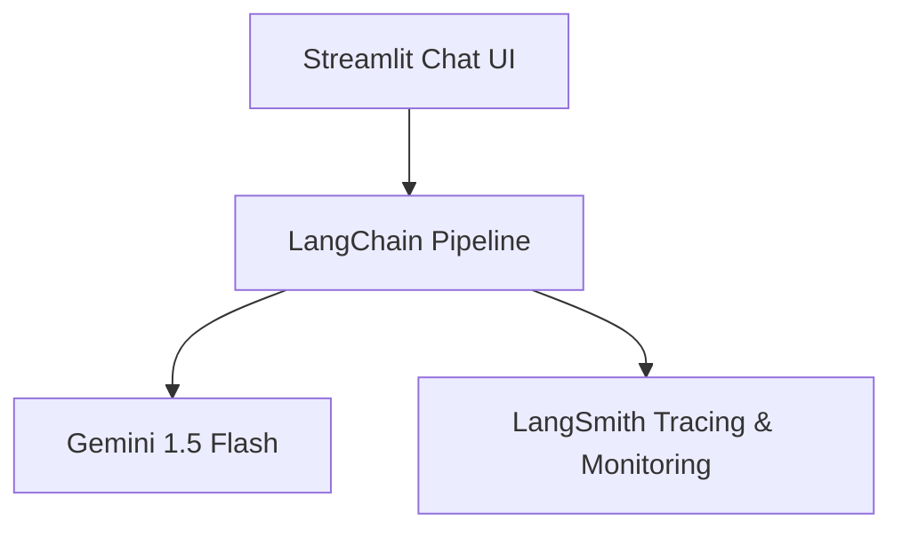

# 🤖 **Geminitor**

### *A Smart, Observable Gemini-Powered Chatbot*

**Geminitor** is a fast, intelligent, and fully traceable conversational AI powered by **Google Gemini 1.5 Flash**, orchestrated with **LangChain**, and monitored end-to-end using **LangSmith (LLMOps)**.

It delivers a **ChatGPT-like user experience** via **Streamlit**, enhanced with **automatic follow-up question suggestions** to drive deeper, more meaningful conversations.

> ⚡ Built for developers who care about performance, observability, and clean UX.

---

## 🌟 Key Highlights

* 🚀 **Ultra-fast responses** using *Gemini 1.5 Flash*
* 🧠 **Composable LLM pipelines** with LangChain
* 📊 **Full LLM observability** via LangSmith (requests, traces, latency)
* 💬 **Modern chat UI** inspired by ChatGPT
* 🤖 **Smart follow-up question generation**
* ☁️ **Lightweight & cloud-deployable** (Codespaces / Streamlit Cloud)

---

## ✨ Features

* 🔥 Powered by **Google Gemini 1.5 Flash**
* 🧩 Modular architecture using **LangChain**
* 📈 End-to-end tracing with **LangSmith (LLMOps)**
* 🖥️ Clean, responsive **Streamlit UI**
* 🧠 Context-aware follow-up suggestions
* ⚙️ Simple setup & minimal dependencies

---

## 📸 Screenshots

### 💬 Chat Interface


### 📊 LangSmith (LLMOps Monitoring)


---

## 🚀 Getting Started

### 🛠️ Prerequisites

* Python **3.9+**
* Google Gemini API Key
* LangSmith API Key

Install dependencies:

```bash
pip install -r requirements.txt
```

---

### 🔐 Environment Variables

Create a `.env` file in the project root:

```env
# Google Gemini API
GOOGLE_API_KEY=your_google_gemini_api_key

# LangSmith (LLMOps)
LANGCHAIN_TRACING_V2=true
LANGCHAIN_API_KEY=your_langsmith_api_key
LANGCHAIN_PROJECT=Geminitor
```

> ⚠️ **Security Note:** Never commit API keys to public repositories.

---

### ▶️ Run Locally

```bash
streamlit run main.py
```

### 🧑‍💻 Run on GitHub Codespaces

```bash
streamlit run main.py --server.port 7860 --server.address 0.0.0.0
```

Open the forwarded port from the Codespaces UI.

---

## 🧠 System Architecture



### Architecture Breakdown

* **Prompt Engineering:** `ChatPromptTemplate`
* **LLM Execution:** `ChatGoogleGenerativeAI`
* **Observability:** LangSmith + LangChain integration

---

## 🧩 Tech Stack

* **LLM Framework:** [LangChain](https://www.langchain.com/)
* **Model:** [Google Gemini 1.5 Flash](https://ai.google.dev/)
* **LLMOps:** [LangSmith](https://smith.langchain.com/)
* **Frontend:** [Streamlit](https://streamlit.io/)

---

## 📂 Project Structure

```bash
.
├── main.py              # Streamlit application entry point
├── requirements.txt     # Python dependencies
└── README.md            # Project documentation
```

---

## 📦 Deployment Support

| Platform            | Status           |
| ------------------- | ---------------- |
| ✅ GitHub Codespaces | Supported        |
| ✅ Streamlit Cloud   | One-click deploy |
| 🔜 Docker           | Planned          |

---

## 🛡️ Disclaimer

This project is intended for **learning, demos, and prototyping**.
For production use, ensure:

* Secure key management
* Backend hardening
* Rate limiting & access control

---

## 👨‍💻 Author

**Tanmay** 🚀
Built with passion for **LLMs**, **clean UI**, and **LLMOps excellence**.

---

## 🏷️ Tags

`#Gemini` `#LangChain` `#LangSmith` `#LLMOps` `#Streamlit`
`#Chatbot` `#GenerativeAI` `#AIEngineering`

---

## 📎 Sample `requirements.txt`

```txt
streamlit
langchain
langchain-google-genai
google-generativeai
```

